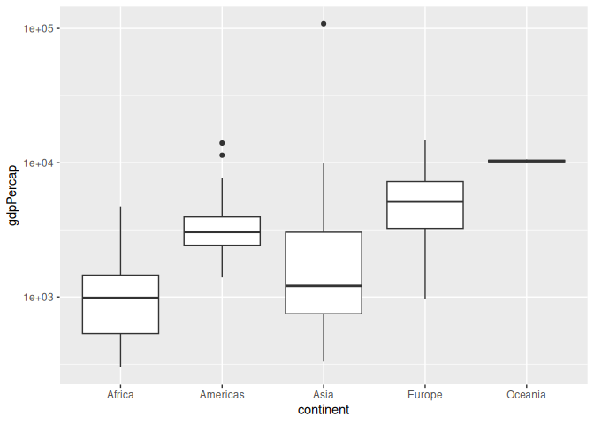
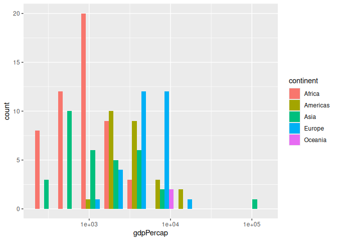
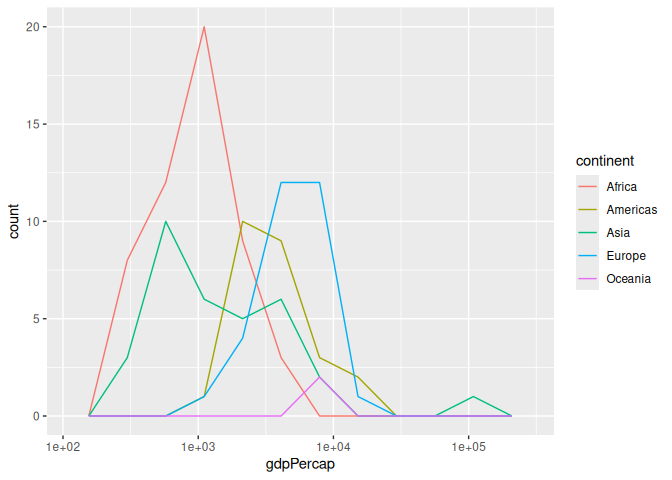
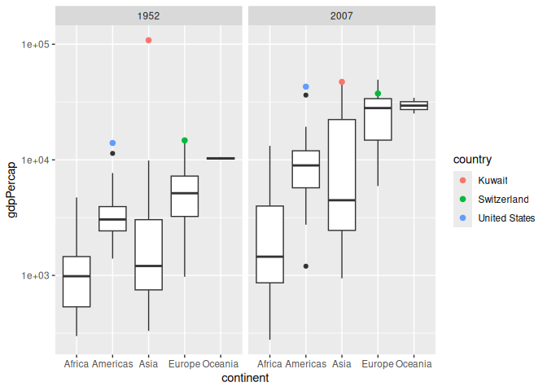
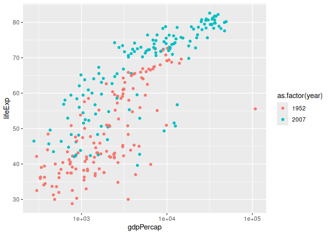
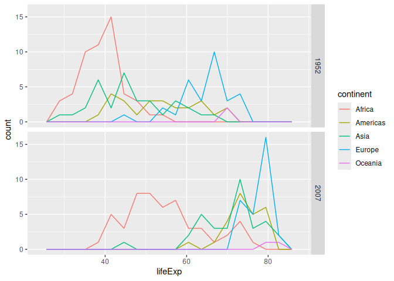
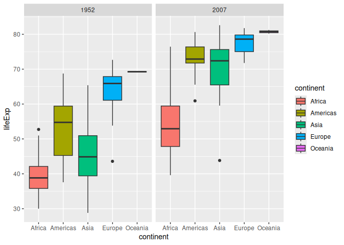
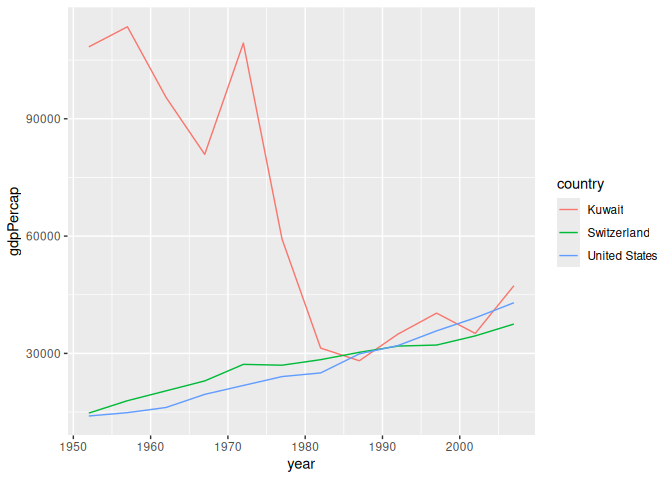

Gapminder
================
Pepper Wang
2026-10-6

- [Grading Rubric](#grading-rubric)
  - [Individual](#individual)
  - [Submission](#submission)
- [Guided EDA](#guided-eda)
  - [**q0** Perform your “first checks” on the dataset. What variables
    are in
    this](#q0-perform-your-first-checks-on-the-dataset-what-variables-are-in-this)
  - [**q1** Determine the most and least recent years in the `gapminder`
    dataset.](#q1-determine-the-most-and-least-recent-years-in-the-gapminder-dataset)
  - [**q2** Filter on years matching `year_min`, and make a plot of the
    GDP per capita against continent. Choose an appropriate `geom_` to
    visualize the data. What observations can you
    make?](#q2-filter-on-years-matching-year_min-and-make-a-plot-of-the-gdp-per-capita-against-continent-choose-an-appropriate-geom_-to-visualize-the-data-what-observations-can-you-make)
  - [**q3** You should have found *at least* three outliers in q2 (but
    possibly many more!). Identify those outliers (figure out which
    countries they
    are).](#q3-you-should-have-found-at-least-three-outliers-in-q2-but-possibly-many-more-identify-those-outliers-figure-out-which-countries-they-are)
  - [**q4** Create a plot similar to yours from q2 studying both
    `year_min` and `year_max`. Find a way to highlight the outliers from
    q3 on your plot *in a way that lets you identify which country is
    which*. Compare the patterns between `year_min` and
    `year_max`.](#q4-create-a-plot-similar-to-yours-from-q2-studying-both-year_min-and-year_max-find-a-way-to-highlight-the-outliers-from-q3-on-your-plot-in-a-way-that-lets-you-identify-which-country-is-which-compare-the-patterns-between-year_min-and-year_max)
- [Your Own EDA](#your-own-eda)
  - [**q5** Create *at least* three new figures below. With each figure,
    try to pose new questions about the
    data.](#q5-create-at-least-three-new-figures-below-with-each-figure-try-to-pose-new-questions-about-the-data)

*Purpose*: Learning to do EDA well takes practice! In this challenge
you’ll further practice EDA by first completing a guided exploration,
then by conducting your own investigation. This challenge will also give
you a chance to use the wide variety of visual tools we’ve been
learning.

<!-- include-rubric -->

# Grading Rubric

<!-- -------------------------------------------------- -->

Unlike exercises, **challenges will be graded**. The following rubrics
define how you will be graded, both on an individual and team basis.

## Individual

<!-- ------------------------- -->

| Category | Needs Improvement | Satisfactory |
|----|----|----|
| Effort | Some task **q**’s left unattempted | All task **q**’s attempted |
| Observed | Did not document observations, or observations incorrect | Documented correct observations based on analysis |
| Supported | Some observations not clearly supported by analysis | All observations clearly supported by analysis (table, graph, etc.) |
| Assessed | Observations include claims not supported by the data, or reflect a level of certainty not warranted by the data | Observations are appropriately qualified by the quality & relevance of the data and (in)conclusiveness of the support |
| Specified | Uses the phrase “more data are necessary” without clarification | Any statement that “more data are necessary” specifies which *specific* data are needed to answer what *specific* question |
| Code Styled | Violations of the [style guide](https://style.tidyverse.org/) hinder readability | Code sufficiently close to the [style guide](https://style.tidyverse.org/) |

## Submission

<!-- ------------------------- -->

Make sure to commit both the challenge report (`report.md` file) and
supporting files (`report_files/` folder) when you are done! Then submit
a link to Canvas. **Your Challenge submission is not complete without
all files uploaded to GitHub.**

``` r
library(tidyverse)
```

    ## ── Attaching core tidyverse packages ──────────────────────── tidyverse 2.0.0 ──
    ## ✔ dplyr     1.2.1     ✔ readr     2.2.0
    ## ✔ forcats   1.0.1     ✔ stringr   1.6.0
    ## ✔ ggplot2   4.0.3     ✔ tibble    3.3.1
    ## ✔ lubridate 1.9.5     ✔ tidyr     1.3.2
    ## ✔ purrr     1.2.2     
    ## ── Conflicts ────────────────────────────────────────── tidyverse_conflicts() ──
    ## ✖ dplyr::filter() masks stats::filter()
    ## ✖ dplyr::lag()    masks stats::lag()
    ## ℹ Use the conflicted package (<http://conflicted.r-lib.org/>) to force all conflicts to become errors

``` r
library(gapminder)
```

*Background*: [Gapminder](https://www.gapminder.org/about-gapminder/) is
an independent organization that seeks to educate people about the state
of the world. They seek to counteract the worldview constructed by a
hype-driven media cycle, and promote a “fact-based worldview” by
focusing on data. The dataset we’ll study in this challenge is from
Gapminder.

# Guided EDA

<!-- -------------------------------------------------- -->

First, we’ll go through a round of *guided EDA*. Try to pay attention to
the high-level process we’re going through—after this guided round
you’ll be responsible for doing another cycle of EDA on your own!

### **q0** Perform your “first checks” on the dataset. What variables are in this

dataset?

``` r
## TASK: Do your "first checks" here!
?gapminder
summary(gapminder)
```

    ##         country        continent        year         lifeExp     
    ##  Afghanistan:  12   Africa  :624   Min.   :1952   Min.   :23.60  
    ##  Albania    :  12   Americas:300   1st Qu.:1966   1st Qu.:48.20  
    ##  Algeria    :  12   Asia    :396   Median :1980   Median :60.71  
    ##  Angola     :  12   Europe  :360   Mean   :1980   Mean   :59.47  
    ##  Argentina  :  12   Oceania : 24   3rd Qu.:1993   3rd Qu.:70.85  
    ##  Australia  :  12                  Max.   :2007   Max.   :82.60  
    ##  (Other)    :1632                                                
    ##       pop              gdpPercap       
    ##  Min.   :6.001e+04   Min.   :   241.2  
    ##  1st Qu.:2.794e+06   1st Qu.:  1202.1  
    ##  Median :7.024e+06   Median :  3531.8  
    ##  Mean   :2.960e+07   Mean   :  7215.3  
    ##  3rd Qu.:1.959e+07   3rd Qu.:  9325.5  
    ##  Max.   :1.319e+09   Max.   :113523.1  
    ## 

**Observations**: - Variables: - Country - Continent - Year - Life
expectancy, in years - Population - GDP per capita, in USD,
inflation-adjusted

### **q1** Determine the most and least recent years in the `gapminder` dataset.

*Hint*: Use the `pull()` function to get a vector out of a tibble.
(Rather than the `$` notation of base R.)

``` r
## TASK: Find the largest and smallest values of `year` in `gapminder`

years <- gapminder |> pull(year)

year_max <- max(years)
year_min <- min(years)

year_max
```

    ## [1] 2007

``` r
year_min
```

    ## [1] 1952

Use the following test to check your work.

``` r
## NOTE: No need to change this
assertthat::assert_that(year_max %% 7 == 5)
```

    ## [1] TRUE

``` r
assertthat::assert_that(year_max %% 3 == 0)
```

    ## [1] TRUE

``` r
assertthat::assert_that(year_min %% 7 == 6)
```

    ## [1] TRUE

``` r
assertthat::assert_that(year_min %% 3 == 2)
```

    ## [1] TRUE

``` r
if (is_tibble(year_max)) {
  print("year_max is a tibble; try using `pull()` to get a vector")
  assertthat::assert_that(False)
}

print("Nice!")
```

    ## [1] "Nice!"

### **q2** Filter on years matching `year_min`, and make a plot of the GDP per capita against continent. Choose an appropriate `geom_` to visualize the data. What observations can you make?

You may encounter difficulties in visualizing these data; if so document
your challenges and attempt to produce the most informative visual you
can.

``` r
## TASK: Create a visual of gdpPercap vs continent
gapminder |>
  filter(year == year_min) |>
  ggplot(aes(x = continent, y = gdpPercap)) +
  geom_boxplot() +
  scale_y_log10()
```

<!-- -->

``` r
## TASK: Create a visual of gdpPercap vs continent
gapminder |>
  filter(year == year_min) |>
  ggplot(aes(x = gdpPercap, fill = continent)) +
  geom_histogram(bins = 10, position = "dodge") +
  scale_x_log10()
```

<!-- -->

``` r
## TASK: Create a visual of gdpPercap vs continent
gapminder |>
  filter(year == year_min) |>
  ggplot(aes(x = gdpPercap, color = continent)) +
  geom_freqpoly(bins = 10) +
  scale_x_log10()
```

<!-- -->

**Observations**:

- Africa has a large number of countries with low GDP per capita. Asia
  is similar but less so. Europe has a wide range that is in the middle.
  Oceania has very few countries but they all have very similar GDP per
  capita. The Americas have mostly countries with low GDP per capita,
  with some outliers that are higher.
- Asia has 1 country that has a GDP per capita many times higher than
  any other country.

**Difficulties & Approaches**:

- There is one extreme outlier country in Asia with a GDP per capita
  that is much higher than any other country. In every plot I tried
  using linear scaling, the outlier caused all the rest of the data to
  get squished and hard to read. Using log scaling makes this much
  better.

### **q3** You should have found *at least* three outliers in q2 (but possibly many more!). Identify those outliers (figure out which countries they are).

``` r
## TASK: Identify the outliers from q2
gapminder |>
  filter(year == year_min) |>
  arrange(desc(gdpPercap))
```

    ## # A tibble: 142 × 6
    ##    country        continent  year lifeExp       pop gdpPercap
    ##    <fct>          <fct>     <int>   <dbl>     <int>     <dbl>
    ##  1 Kuwait         Asia       1952    55.6    160000   108382.
    ##  2 Switzerland    Europe     1952    69.6   4815000    14734.
    ##  3 United States  Americas   1952    68.4 157553000    13990.
    ##  4 Canada         Americas   1952    68.8  14785584    11367.
    ##  5 New Zealand    Oceania    1952    69.4   1994794    10557.
    ##  6 Norway         Europe     1952    72.7   3327728    10095.
    ##  7 Australia      Oceania    1952    69.1   8691212    10040.
    ##  8 United Kingdom Europe     1952    69.2  50430000     9980.
    ##  9 Bahrain        Asia       1952    50.9    120447     9867.
    ## 10 Denmark        Europe     1952    70.8   4334000     9692.
    ## # ℹ 132 more rows

**Observations**:

- Identify the outlier countries from q2
  - The largest outlier is Kuwait. The two smaller outliers are
    Switzerland and the United States.

*Hint*: For the next task, it’s helpful to know a ggplot trick we’ll
learn in an upcoming exercise: You can use the `data` argument inside
any `geom_*` to modify the data that will be plotted *by that geom
only*. For instance, you can use this trick to filter a set of points to
label:

``` r
## NOTE: No need to edit, use ideas from this in q4 below
gapminder %>%
  filter(year == max(year)) %>%

  ggplot(aes(continent, lifeExp)) +
  geom_boxplot() +
  geom_point(
    data = . %>% filter(country %in% c("United Kingdom", "Japan", "Zambia")),
    mapping = aes(color = country),
    size = 2
  )
```

<!-- -->

### **q4** Create a plot similar to yours from q2 studying both `year_min` and `year_max`. Find a way to highlight the outliers from q3 on your plot *in a way that lets you identify which country is which*. Compare the patterns between `year_min` and `year_max`.

*Hint*: We’ve learned a lot of different ways to show multiple
variables; think about using different aesthetics or facets.

``` r
## TASK: Create a visual of gdpPercap vs continent
gapminder |>
  filter(year == year_min | year == year_max) |>
  ggplot(aes(x = continent, y = gdpPercap)) +
  geom_boxplot() +
  scale_y_log10() +
  facet_grid(cols = vars(year)) +
  geom_point(
    data = . %>% filter(country %in% c(
      "Kuwait", "Switzerland", "United States"
    )),
    mapping = aes(color = country),
    size = 2
  )
```

<!-- -->

**Observations**:

- Write your observations here
  - Every continent had generally much higher and more varied GDP per
    capita in 2007 compared to 1952.
  - Kuwait was a large outlier in 1952; in 2007, it is no longer such an
    extreme outlier, but it still has the highest GDP per capita in
    Asia.

# Your Own EDA

<!-- -------------------------------------------------- -->

Now it’s your turn! We just went through guided EDA considering the GDP
per capita at two time points. You can continue looking at outliers,
consider different years, repeat the exercise with `lifeExp`, consider
the relationship between variables, or something else entirely.

### **q5** Create *at least* three new figures below. With each figure, try to pose new questions about the data.

``` r
gapminder |>
  filter(year == year_min | year == year_max) |>
  ggplot(aes(x = gdpPercap, y = lifeExp, color = as.factor(year))) +
  geom_point() +
  scale_x_log10()
```

<!-- -->

- There seems to be a positive correlation between GDP per capita and
  life expectancy, though there is a lot of variation within it
- Between 1952 and 2007, overall GDP per capita and life expectancy both
  increased substantially, though the variation in both of these seems
  to have stayed about the same

``` r
gapminder |>
  filter(year == year_min | year == year_max) |>
  ggplot(aes(lifeExp, color = continent)) +
  geom_freqpoly(bins = 18) +
  facet_grid(rows = vars(year))
```

<!-- -->

- Between 1952 and 2007, most continents’ life expectancy had an overall
  increase
- Specifically, Asia and the Americas were previously in the low to
  medium range, and they both ended up on the high end of the plot,
  close to Europe.

``` r
gapminder |>
  filter(year == year_min | year == year_max) |>
  ggplot(aes(x = continent, y = lifeExp)) +
  geom_boxplot(aes(fill = continent)) +
  facet_grid(cols = vars(year))
```

<!-- -->

- This graph conveys similar information to the previous one, about
  changes in life expectancy across continents.

``` r
gapminder |>
  filter(country %in% c(
    "Kuwait", "Switzerland", "United States"
  )) |>
  ggplot(aes(x = year, y = gdpPercap, color = country)) +
  geom_line()
```

<!-- -->

- Kuwait (the biggest GDP per capita outlier in 1952) has a GDP per
  capita that decreases from 1957 to 1987, until it is similar to the
  GDP per capita of Switzerland and the United States, then increases at
  about the same rate as Switzerland and the United States.
